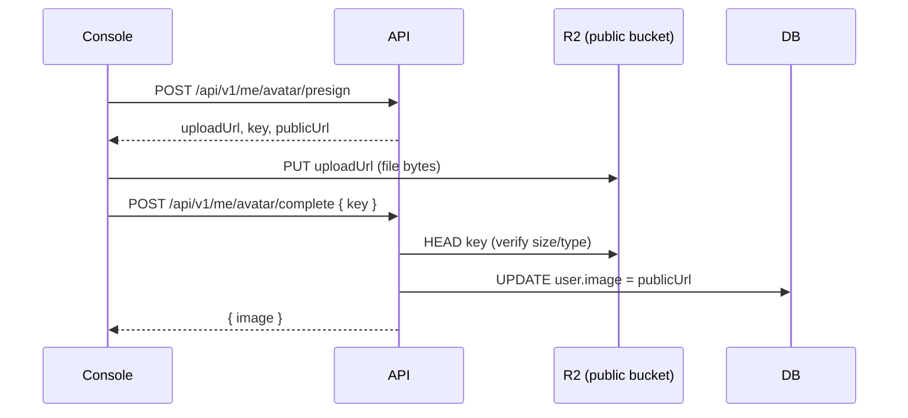
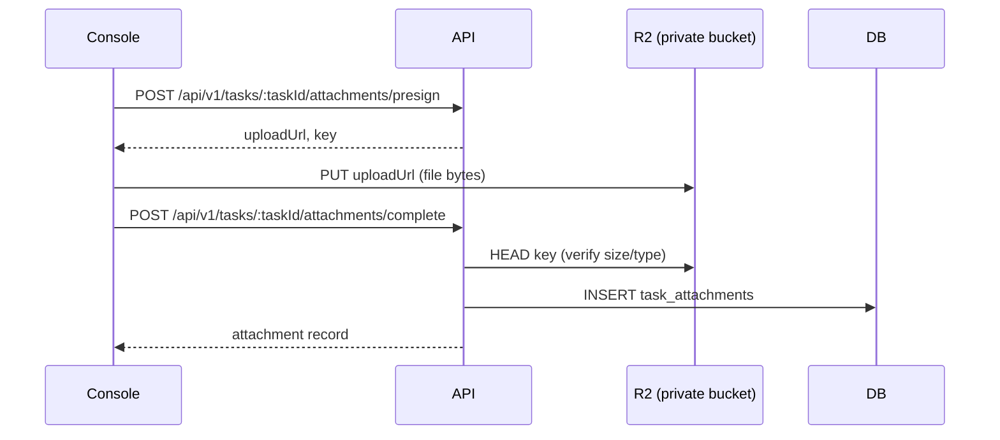
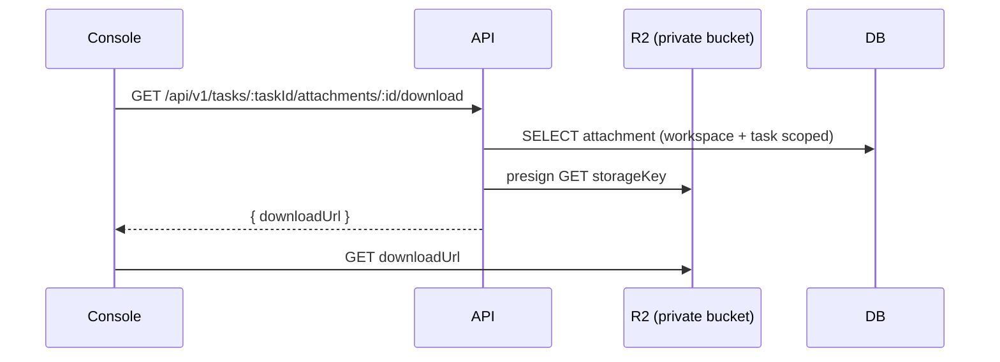

# S3-compatible object storage

Cloudflare R2 (S3 API) backs user avatars (public bucket) and task attachments (private bucket). Uploads use presigned PUT URLs; private downloads use presigned GET URLs.

## Buckets

| Bucket | Purpose | Access |
|--------|---------|--------|
| `S3_BUCKET_PUBLIC` | Avatars | Public CDN via `S3_PUBLIC_BASE_URL` |
| `S3_BUCKET_PRIVATE` | Task attachments | Presigned GET only |

## Key layout

- Public: `avatars/{userId}/{uuid}.{ext}`
- Private: `attachments/{workspaceId}/{taskId}/{uuid}.{ext}`

## Limits

- Max size: 10 MB
- Allowed MIME: `image/jpeg`, `image/png`, `image/webp`, `image/gif`, `application/pdf`, `text/plain`

## Avatar upload

## Attachment upload

## Attachment download

## Environment

See `apps/api/.env.example` (`S3_*` variables). Endpoint defaults to `https://{S3_ACCOUNT_ID}.r2.cloudflarestorage.com` when `S3_ENDPOINT` is omitted.

## Packages

- `@repro-v2/s3` — client, presign, head, key builders
- API modules: `apps/api/src/modules/me`, attachment routes under `apps/api/src/modules/tasks`
- Console: Settings (avatar), Tasks (attachments)
